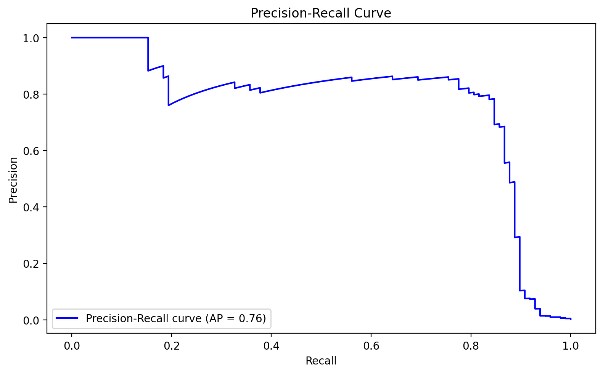
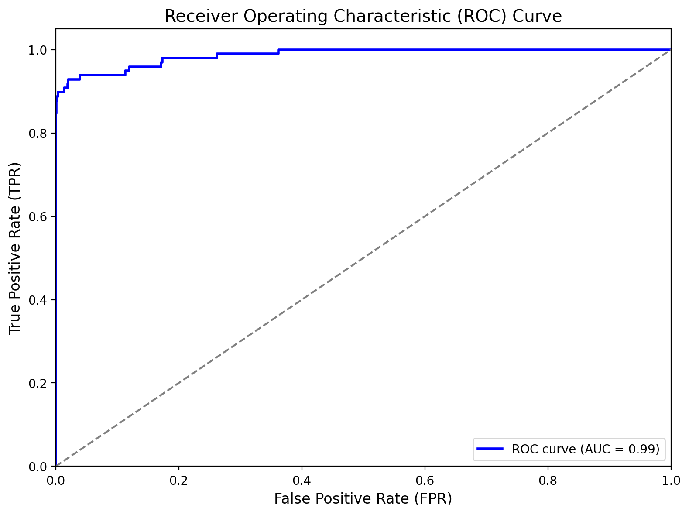
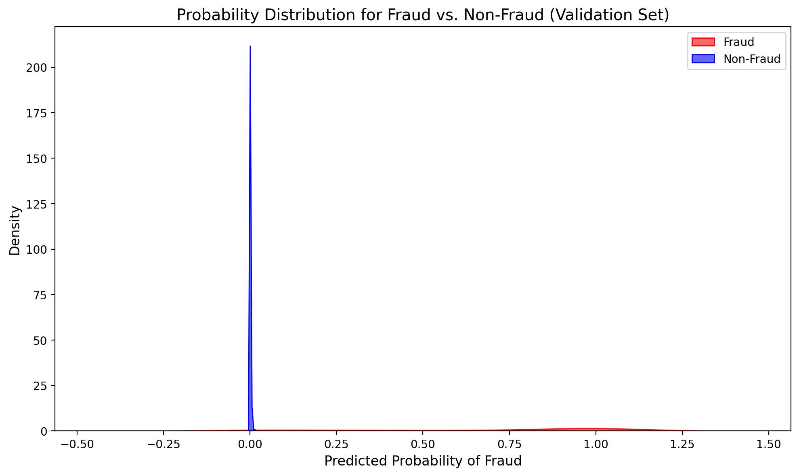
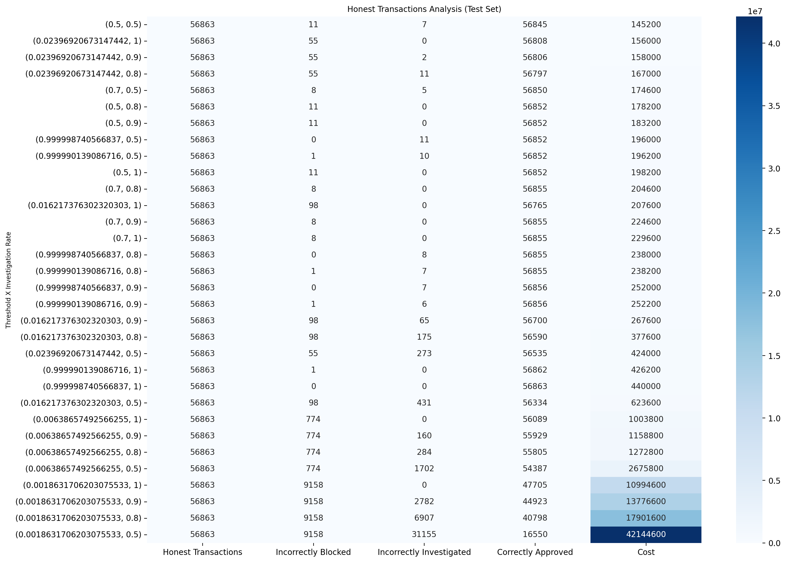

# Credit Card Fraud Detection Project

## Author
Rafael Severiano

## Objective
Build a cost-sensitive machine learning model to detect fraudulent transactions and support operational decision-making (approve, block, investigate).

## Problem Framing
Dataset: Credit Card Fraud Detection (Kaggle source)  
https://www.kaggle.com/datasets/mlg-ulb/creditcardfraud
Download the dataset and place creditcard.csv inside the data/ folder.

Fraudulent transactions are extremely rare, creating a highly imbalanced classification problem.

Operational costs modeled:
- Approving a fraudulent transaction
- Blocking a legitimate transaction
- Investigating a legitimate transaction

Goal: minimize total expected cost by selecting the best decision threshold and investigation rate.

## Model
- Logistic Regression
- GridSearchCV
- Stratified 5-fold cross-validation
- Optimization metric: Precision

## Threshold Optimization
- Precision–Recall curve used to select candidate thresholds
- Multiple investigation rates tested
- Cost evaluated for each (threshold, investigation_rate)
- Best policy selected on validation set
- Final evaluation on test set

## Model Evaluation

### Precision–Recall Curve


### ROC Curve


### Probability Distribution


## Final Results (Test Set)

### Fraud Transactions Analysis (Test Set)


### Honest Transactions Analysis (Test Set)


## How to Run
```bash
pip install -r requirements.txt

