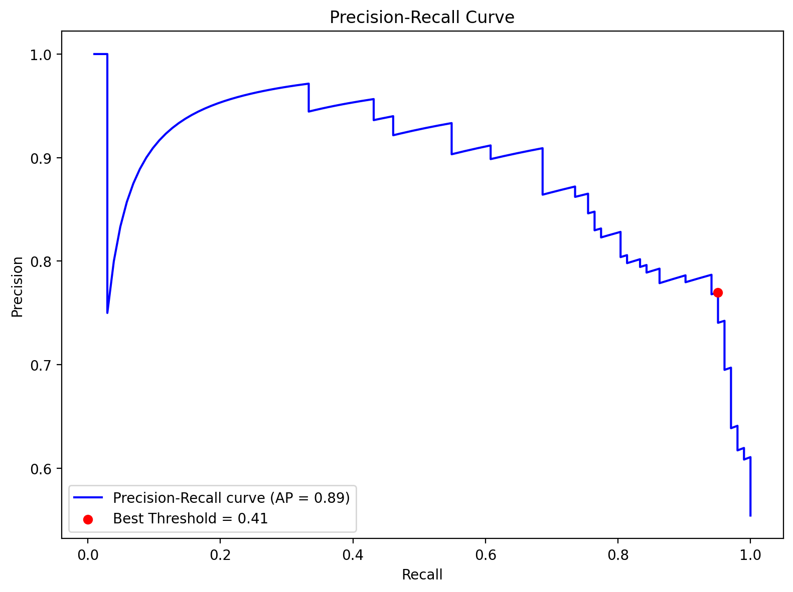

# Heart Disease Classification

## Author
**Rafael Severiano**

## Objective
Build a conservative machine learning model to classify heart disease, prioritizing recall to minimize false negatives.

## Problem Framing
-Dataset: UCI Hearth Disease (Kaggle source)
https://www.kaggle.com/datasets/redwankarimsony/heart-disease-data/data
- Binary classification (disease vs no disease)
- Focus on high recall
- Threshold tuning based on Precision–Recall curve

## Models Tested
- Logistic Regression
- Random Forest
- MLP Classifier

## Model Selection
Random Forest was selected based on cross-validated recall performance and validation set evaluation, aligning with the project's conservative objective of minimizing false negatives.

## Final Results
### Confusion Matrix

### Metrics


## Additional Visualizations

### Precision-Recall Curve


## How to Run
```bash
pip install -r requirements.txt
python heart_disease_classification_project.py
