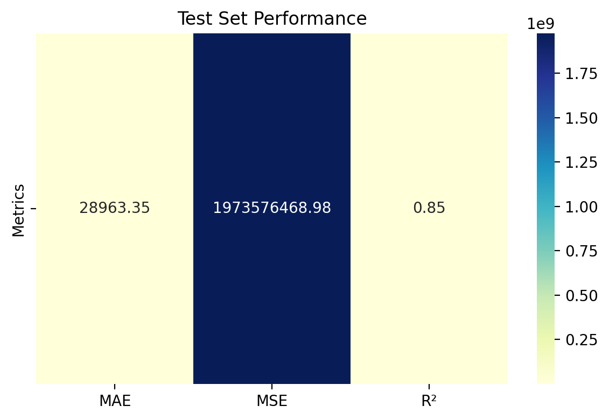

# House Price Prediction – Regression + EDA

## Overview

This project predicts the median house value of California districts using socioeconomic and geographic data from the 1990 Census.

The workflow includes:
- Exploratory Data Analysis (EDA)
- Feature Engineering
- XGBoost Regression
- Hyperparameter tuning with 10-fold Cross-Validation
- Performance evaluation across different price ranges


## Dataset

- Name: California Housing Prices
- Source: https://www.kaggle.com/datasets/camnugent/california-housing-prices/data
- Problem Type: Supervised Learning – Regression

## Model

- Algorithm: XGBoost Regressor
- Hyperparameter tuning: GridSearchCV
- Validation: 10-fold Cross-Validation
- Optimization metric: Mean Absolute Error (MAE)

## Results

### Test Performance


### Actual vs Predicted Values


### Evaluation by Price Range


## How to Run

```bash
pip install -r requirements.txt
```

